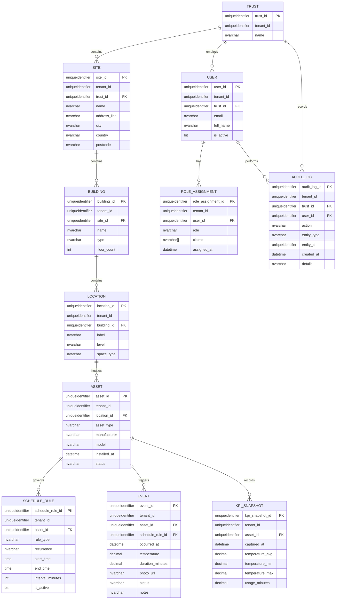

# Trust Asset Management Architecture Specs

## Entity Relationship Diagram


## Azure SQL Schema
```sql
CREATE TABLE dbo.Trust (
    trust_id UNIQUEIDENTIFIER NOT NULL DEFAULT NEWID(),
    tenant_id UNIQUEIDENTIFIER NOT NULL,
    name NVARCHAR(200) NOT NULL,
    created_at DATETIME2 NOT NULL DEFAULT SYSUTCDATETIME(),
    updated_at DATETIME2 NULL,
    CONSTRAINT PK_Trust PRIMARY KEY (trust_id),
    CONSTRAINT UQ_Trust_Name UNIQUE (tenant_id, name)
);

CREATE TABLE dbo.Site (
    site_id UNIQUEIDENTIFIER NOT NULL DEFAULT NEWID(),
    tenant_id UNIQUEIDENTIFIER NOT NULL,
    trust_id UNIQUEIDENTIFIER NOT NULL,
    name NVARCHAR(200) NOT NULL,
    address_line NVARCHAR(200) NULL,
    city NVARCHAR(100) NULL,
    country NVARCHAR(100) NULL,
    postcode NVARCHAR(20) NULL,
    created_at DATETIME2 NOT NULL DEFAULT SYSUTCDATETIME(),
    updated_at DATETIME2 NULL,
    CONSTRAINT PK_Site PRIMARY KEY (site_id),
    CONSTRAINT FK_Site_Trust FOREIGN KEY (trust_id, tenant_id) REFERENCES dbo.Trust (trust_id, tenant_id)
);

CREATE TABLE dbo.Building (
    building_id UNIQUEIDENTIFIER NOT NULL DEFAULT NEWID(),
    tenant_id UNIQUEIDENTIFIER NOT NULL,
    site_id UNIQUEIDENTIFIER NOT NULL,
    name NVARCHAR(200) NOT NULL,
    type NVARCHAR(100) NULL,
    floor_count INT NULL,
    created_at DATETIME2 NOT NULL DEFAULT SYSUTCDATETIME(),
    updated_at DATETIME2 NULL,
    CONSTRAINT PK_Building PRIMARY KEY (building_id),
    CONSTRAINT FK_Building_Site FOREIGN KEY (site_id, tenant_id) REFERENCES dbo.Site (site_id, tenant_id)
);

CREATE TABLE dbo.Location (
    location_id UNIQUEIDENTIFIER NOT NULL DEFAULT NEWID(),
    tenant_id UNIQUEIDENTIFIER NOT NULL,
    building_id UNIQUEIDENTIFIER NOT NULL,
    label NVARCHAR(200) NOT NULL,
    level NVARCHAR(50) NULL,
    space_type NVARCHAR(100) NULL,
    created_at DATETIME2 NOT NULL DEFAULT SYSUTCDATETIME(),
    updated_at DATETIME2 NULL,
    CONSTRAINT PK_Location PRIMARY KEY (location_id),
    CONSTRAINT FK_Location_Building FOREIGN KEY (building_id, tenant_id) REFERENCES dbo.Building (building_id, tenant_id)
);

CREATE TABLE dbo.Asset (
    asset_id UNIQUEIDENTIFIER NOT NULL DEFAULT NEWID(),
    tenant_id UNIQUEIDENTIFIER NOT NULL,
    location_id UNIQUEIDENTIFIER NOT NULL,
    asset_type NVARCHAR(50) NOT NULL CHECK (asset_type IN ('tap', 'shower')),
    manufacturer NVARCHAR(100) NULL,
    model NVARCHAR(100) NULL,
    installed_at DATETIME2 NULL,
    status NVARCHAR(50) NOT NULL DEFAULT 'active',
    created_at DATETIME2 NOT NULL DEFAULT SYSUTCDATETIME(),
    updated_at DATETIME2 NULL,
    CONSTRAINT PK_Asset PRIMARY KEY (asset_id),
    CONSTRAINT FK_Asset_Location FOREIGN KEY (location_id, tenant_id) REFERENCES dbo.Location (location_id, tenant_id)
);

CREATE TABLE dbo.ScheduleRule (
    schedule_rule_id UNIQUEIDENTIFIER NOT NULL DEFAULT NEWID(),
    tenant_id UNIQUEIDENTIFIER NOT NULL,
    asset_id UNIQUEIDENTIFIER NOT NULL,
    rule_type NVARCHAR(50) NOT NULL,
    recurrence NVARCHAR(200) NOT NULL,
    start_time TIME NULL,
    end_time TIME NULL,
    interval_minutes INT NULL,
    is_active BIT NOT NULL DEFAULT 1,
    created_at DATETIME2 NOT NULL DEFAULT SYSUTCDATETIME(),
    updated_at DATETIME2 NULL,
    CONSTRAINT PK_ScheduleRule PRIMARY KEY (schedule_rule_id),
    CONSTRAINT FK_ScheduleRule_Asset FOREIGN KEY (asset_id, tenant_id) REFERENCES dbo.Asset (asset_id, tenant_id)
);

CREATE TABLE dbo.Event (
    event_id UNIQUEIDENTIFIER NOT NULL DEFAULT NEWID(),
    tenant_id UNIQUEIDENTIFIER NOT NULL,
    asset_id UNIQUEIDENTIFIER NOT NULL,
    schedule_rule_id UNIQUEIDENTIFIER NULL,
    occurred_at DATETIME2 NOT NULL,
    temperature DECIMAL(5,2) NULL,
    duration_minutes DECIMAL(6,2) NULL,
    photo_url NVARCHAR(500) NULL,
    status NVARCHAR(50) NOT NULL DEFAULT 'pending',
    notes NVARCHAR(MAX) NULL,
    created_at DATETIME2 NOT NULL DEFAULT SYSUTCDATETIME(),
    updated_at DATETIME2 NULL,
    CONSTRAINT PK_Event PRIMARY KEY (event_id),
    CONSTRAINT FK_Event_Asset FOREIGN KEY (asset_id, tenant_id) REFERENCES dbo.Asset (asset_id, tenant_id),
    CONSTRAINT FK_Event_ScheduleRule FOREIGN KEY (schedule_rule_id, tenant_id) REFERENCES dbo.ScheduleRule (schedule_rule_id, tenant_id)
);

CREATE TABLE dbo.KPI_Snapshot (
    kpi_snapshot_id UNIQUEIDENTIFIER NOT NULL DEFAULT NEWID(),
    tenant_id UNIQUEIDENTIFIER NOT NULL,
    asset_id UNIQUEIDENTIFIER NOT NULL,
    captured_at DATETIME2 NOT NULL,
    temperature_avg DECIMAL(5,2) NULL,
    temperature_min DECIMAL(5,2) NULL,
    temperature_max DECIMAL(5,2) NULL,
    usage_minutes DECIMAL(8,2) NULL,
    created_at DATETIME2 NOT NULL DEFAULT SYSUTCDATETIME(),
    CONSTRAINT PK_KPI_Snapshot PRIMARY KEY (kpi_snapshot_id),
    CONSTRAINT FK_KPI_Snapshot_Asset FOREIGN KEY (asset_id, tenant_id) REFERENCES dbo.Asset (asset_id, tenant_id)
);

CREATE TABLE dbo.[User] (
    user_id UNIQUEIDENTIFIER NOT NULL DEFAULT NEWID(),
    tenant_id UNIQUEIDENTIFIER NOT NULL,
    trust_id UNIQUEIDENTIFIER NOT NULL,
    email NVARCHAR(200) NOT NULL,
    full_name NVARCHAR(200) NOT NULL,
    is_active BIT NOT NULL DEFAULT 1,
    password_hash VARBINARY(256) NULL,
    created_at DATETIME2 NOT NULL DEFAULT SYSUTCDATETIME(),
    updated_at DATETIME2 NULL,
    CONSTRAINT PK_User PRIMARY KEY (user_id),
    CONSTRAINT UQ_User_Email UNIQUE (tenant_id, email),
    CONSTRAINT FK_User_Trust FOREIGN KEY (trust_id, tenant_id) REFERENCES dbo.Trust (trust_id, tenant_id)
);

CREATE TABLE dbo.RoleAssignment (
    role_assignment_id UNIQUEIDENTIFIER NOT NULL DEFAULT NEWID(),
    tenant_id UNIQUEIDENTIFIER NOT NULL,
    user_id UNIQUEIDENTIFIER NOT NULL,
    role NVARCHAR(50) NOT NULL CHECK (role IN ('Manager', 'Supervisor', 'Technician')),
    claims NVARCHAR(MAX) NULL,
    assigned_at DATETIME2 NOT NULL DEFAULT SYSUTCDATETIME(),
    revoked_at DATETIME2 NULL,
    CONSTRAINT PK_RoleAssignment PRIMARY KEY (role_assignment_id),
    CONSTRAINT FK_RoleAssignment_User FOREIGN KEY (user_id, tenant_id) REFERENCES dbo.[User] (user_id, tenant_id)
);

CREATE TABLE dbo.AuditLog (
    audit_log_id UNIQUEIDENTIFIER NOT NULL DEFAULT NEWID(),
    tenant_id UNIQUEIDENTIFIER NOT NULL,
    trust_id UNIQUEIDENTIFIER NOT NULL,
    user_id UNIQUEIDENTIFIER NULL,
    action NVARCHAR(200) NOT NULL,
    entity_type NVARCHAR(200) NOT NULL,
    entity_id UNIQUEIDENTIFIER NULL,
    details NVARCHAR(MAX) NULL,
    created_at DATETIME2 NOT NULL DEFAULT SYSUTCDATETIME(),
    CONSTRAINT PK_AuditLog PRIMARY KEY (audit_log_id),
    CONSTRAINT FK_AuditLog_Trust FOREIGN KEY (trust_id, tenant_id) REFERENCES dbo.Trust (trust_id, tenant_id),
    CONSTRAINT FK_AuditLog_User FOREIGN KEY (user_id, tenant_id) REFERENCES dbo.[User] (user_id, tenant_id)
);

CREATE UNIQUE INDEX IX_Event_AssetTime ON dbo.Event (tenant_id, asset_id, occurred_at DESC);
CREATE INDEX IX_ScheduleRule_Asset ON dbo.ScheduleRule (tenant_id, asset_id, is_active);
CREATE INDEX IX_KPI_Snapshot_AssetTime ON dbo.KPI_Snapshot (tenant_id, asset_id, captured_at DESC);
```

## REST API (OpenAPI excerpt)
```yaml
openapi: 3.1.0
info:
  title: Trust Asset Management API
  version: 0.1.0
servers:
  - url: https://api.example.com
    description: Production
  - url: https://staging-api.example.com
    description: Staging
components:
  parameters:
    TenantHeader:
      in: header
      name: X-Tenant-ID
      required: true
      schema:
        type: string
        format: uuid
  securitySchemes:
    bearerAuth:
      type: http
      scheme: bearer
      bearerFormat: JWT
  schemas:
    TenantScoped:
      type: object
      properties:
        tenantId:
          type: string
          format: uuid
      required: [tenantId]
    Trust:
      allOf:
        - $ref: '#/components/schemas/TenantScoped'
        - type: object
          properties:
            trustId:
              type: string
              format: uuid
            name:
              type: string
            createdAt:
              type: string
              format: date-time
            updatedAt:
              type: string
              format: date-time
          required: [trustId, name, createdAt]
    Site:
      allOf:
        - $ref: '#/components/schemas/TenantScoped'
        - type: object
          properties:
            siteId:
              type: string
              format: uuid
            trustId:
              type: string
              format: uuid
            name:
              type: string
            addressLine:
              type: string
            city:
              type: string
            country:
              type: string
            postcode:
              type: string
            createdAt:
              type: string
              format: date-time
            updatedAt:
              type: string
              format: date-time
          required: [siteId, trustId, name, createdAt]
    Building:
      allOf:
        - $ref: '#/components/schemas/TenantScoped'
        - type: object
          properties:
            buildingId:
              type: string
              format: uuid
            siteId:
              type: string
              format: uuid
            name:
              type: string
            type:
              type: string
            floorCount:
              type: integer
            createdAt:
              type: string
              format: date-time
            updatedAt:
              type: string
              format: date-time
          required: [buildingId, siteId, name, createdAt]
    Location:
      allOf:
        - $ref: '#/components/schemas/TenantScoped'
        - type: object
          properties:
            locationId:
              type: string
              format: uuid
            buildingId:
              type: string
              format: uuid
            label:
              type: string
            level:
              type: string
            spaceType:
              type: string
            createdAt:
              type: string
              format: date-time
            updatedAt:
              type: string
              format: date-time
          required: [locationId, buildingId, label, createdAt]
    Asset:
      allOf:
        - $ref: '#/components/schemas/TenantScoped'
        - type: object
          properties:
            assetId:
              type: string
              format: uuid
            locationId:
              type: string
              format: uuid
            assetType:
              type: string
              enum: [tap, shower]
            manufacturer:
              type: string
            model:
              type: string
            installedAt:
              type: string
              format: date-time
            status:
              type: string
            createdAt:
              type: string
              format: date-time
            updatedAt:
              type: string
              format: date-time
          required: [assetId, locationId, assetType, status, createdAt]
    ScheduleRule:
      allOf:
        - $ref: '#/components/schemas/TenantScoped'
        - type: object
          properties:
            scheduleRuleId:
              type: string
              format: uuid
            assetId:
              type: string
              format: uuid
            ruleType:
              type: string
            recurrence:
              type: string
            startTime:
              type: string
              format: time
            endTime:
              type: string
              format: time
            intervalMinutes:
              type: integer
            isActive:
              type: boolean
            createdAt:
              type: string
              format: date-time
            updatedAt:
              type: string
              format: date-time
          required: [scheduleRuleId, assetId, ruleType, recurrence, isActive, createdAt]
    Event:
      allOf:
        - $ref: '#/components/schemas/TenantScoped'
        - type: object
          properties:
            eventId:
              type: string
              format: uuid
            assetId:
              type: string
              format: uuid
            scheduleRuleId:
              type: string
              format: uuid
              nullable: true
            occurredAt:
              type: string
              format: date-time
            temperature:
              type: number
              format: float
              nullable: true
            durationMinutes:
              type: number
              format: float
              nullable: true
            photoUrl:
              type: string
              format: uri
              nullable: true
            status:
              type: string
            notes:
              type: string
              nullable: true
            createdAt:
              type: string
              format: date-time
            updatedAt:
              type: string
              format: date-time
          required: [eventId, assetId, occurredAt, status, createdAt]
    KPI_Snapshot:
      allOf:
        - $ref: '#/components/schemas/TenantScoped'
        - type: object
          properties:
            kpiSnapshotId:
              type: string
              format: uuid
            assetId:
              type: string
              format: uuid
            capturedAt:
              type: string
              format: date-time
            temperatureAvg:
              type: number
              format: float
            temperatureMin:
              type: number
              format: float
            temperatureMax:
              type: number
              format: float
            usageMinutes:
              type: number
              format: float
            createdAt:
              type: string
              format: date-time
          required: [kpiSnapshotId, assetId, capturedAt, createdAt]
    User:
      allOf:
        - $ref: '#/components/schemas/TenantScoped'
        - type: object
          properties:
            userId:
              type: string
              format: uuid
            trustId:
              type: string
              format: uuid
            email:
              type: string
              format: email
            fullName:
              type: string
            isActive:
              type: boolean
            createdAt:
              type: string
              format: date-time
            updatedAt:
              type: string
              format: date-time
          required: [userId, trustId, email, fullName, isActive, createdAt]
    RoleAssignment:
      allOf:
        - $ref: '#/components/schemas/TenantScoped'
        - type: object
          properties:
            roleAssignmentId:
              type: string
              format: uuid
            userId:
              type: string
              format: uuid
            role:
              type: string
              enum: [Manager, Supervisor, Technician]
            claims:
              type: array
              items:
                type: string
            assignedAt:
              type: string
              format: date-time
            revokedAt:
              type: string
              format: date-time
              nullable: true
          required: [roleAssignmentId, userId, role, assignedAt]
    AuditLog:
      allOf:
        - $ref: '#/components/schemas/TenantScoped'
        - type: object
          properties:
            auditLogId:
              type: string
              format: uuid
            trustId:
              type: string
              format: uuid
            userId:
              type: string
              format: uuid
              nullable: true
            action:
              type: string
            entityType:
              type: string
            entityId:
              type: string
              format: uuid
              nullable: true
            details:
              type: string
              nullable: true
            createdAt:
              type: string
              format: date-time
          required: [auditLogId, trustId, action, entityType, createdAt]
security:
  - bearerAuth: []
paths:
  /trusts:
    get:
      summary: List trusts
      security:
        - bearerAuth: []
      parameters:
        - in: query
          name: tenantId
          schema:
            type: string
            format: uuid
          required: true
      responses:
        '200':
          description: Trust collection
          content:
            application/json:
              schema:
                type: array
                items:
                  $ref: '#/components/schemas/Trust'
    post:
      summary: Create trust
      security:
        - bearerAuth: []
      requestBody:
        required: true
        content:
          application/json:
            schema:
              type: object
              required: [tenantId, name]
              properties:
                tenantId:
                  type: string
                  format: uuid
                name:
                  type: string
      responses:
        '201':
          description: Trust created
          content:
            application/json:
              schema:
                $ref: '#/components/schemas/Trust'
  /trusts/{trustId}:
    get:
      summary: Retrieve trust
      parameters:
        - in: path
          name: trustId
          required: true
          schema:
            type: string
            format: uuid
        - in: header
          name: X-Tenant-ID
          required: true
          schema:
            type: string
            format: uuid
      responses:
        '200':
          description: Trust detail
          content:
            application/json:
              schema:
                $ref: '#/components/schemas/Trust'
    patch:
      summary: Update trust
      parameters:
        - in: path
          name: trustId
          required: true
          schema:
            type: string
            format: uuid
        - $ref: '#/components/parameters/TenantHeader'
      responses:
        '200':
          description: Updated trust
          content:
            application/json:
              schema:
                $ref: '#/components/schemas/Trust'
    delete:
      summary: Archive trust
      parameters:
        - in: path
          name: trustId
          required: true
          schema:
            type: string
            format: uuid
        - $ref: '#/components/parameters/TenantHeader'
      responses:
        '204':
          description: Deleted
  /sites:
    get:
      summary: List sites by trust
      parameters:
        - in: query
          name: trustId
          schema:
            type: string
            format: uuid
          required: true
        - in: header
          name: X-Tenant-ID
          required: true
          schema:
            type: string
            format: uuid
      responses:
        '200':
          description: Site collection
          content:
            application/json:
              schema:
                type: array
                items:
                  $ref: '#/components/schemas/Site'
    post:
      summary: Create site
      requestBody:
        required: true
        content:
          application/json:
            schema:
              $ref: '#/components/schemas/Site'
      responses:
        '201':
          description: Site created
  /sites/{siteId}:
    get:
      summary: Retrieve site
      parameters:
        - in: path
          name: siteId
          required: true
          schema:
            type: string
            format: uuid
        - in: header
          name: X-Tenant-ID
          required: true
          schema:
            type: string
            format: uuid
      responses:
        '200':
          description: Site detail
          content:
            application/json:
              schema:
                $ref: '#/components/schemas/Site'
    patch:
      summary: Update site
      parameters:
        - in: path
          name: siteId
          required: true
          schema:
            type: string
            format: uuid
        - $ref: '#/components/parameters/TenantHeader'
      responses:
        '200':
          description: Updated site
          content:
            application/json:
              schema:
                $ref: '#/components/schemas/Site'
    delete:
      summary: Archive site
      parameters:
        - in: path
          name: siteId
          required: true
          schema:
            type: string
            format: uuid
        - $ref: '#/components/parameters/TenantHeader'
      responses:
        '204':
          description: Deleted
  /buildings:
    get:
      summary: List buildings
      parameters:
        - in: query
          name: siteId
          schema:
            type: string
            format: uuid
          required: true
        - in: header
          name: X-Tenant-ID
          required: true
          schema:
            type: string
            format: uuid
      responses:
        '200':
          description: Building collection
          content:
            application/json:
              schema:
                type: array
                items:
                  $ref: '#/components/schemas/Building'
    post:
      summary: Create building
      requestBody:
        required: true
        content:
          application/json:
            schema:
              $ref: '#/components/schemas/Building'
      responses:
        '201':
          description: Building created
  /assets:
    get:
      summary: List assets
      parameters:
        - in: query
          name: locationId
          schema:
            type: string
            format: uuid
        - in: query
          name: assetType
          schema:
            type: string
            enum: [tap, shower]
        - in: query
          name: status
          schema:
            type: string
        - in: header
          name: X-Tenant-ID
          required: true
          schema:
            type: string
            format: uuid
      responses:
        '200':
          description: Asset collection
          content:
            application/json:
              schema:
                type: array
                items:
                  $ref: '#/components/schemas/Asset'
    post:
      summary: Create asset
      requestBody:
        required: true
        content:
          application/json:
            schema:
              $ref: '#/components/schemas/Asset'
      responses:
        '201':
          description: Asset created
  /assets/{assetId}:
    get:
      summary: Retrieve asset
      parameters:
        - in: path
          name: assetId
          required: true
          schema:
            type: string
            format: uuid
        - in: header
          name: X-Tenant-ID
          required: true
          schema:
            type: string
            format: uuid
      responses:
        '200':
          description: Asset detail
          content:
            application/json:
              schema:
                $ref: '#/components/schemas/Asset'
    patch:
      summary: Update asset
      parameters:
        - in: path
          name: assetId
          required: true
          schema:
            type: string
            format: uuid
        - $ref: '#/components/parameters/TenantHeader'
      responses:
        '200':
          description: Updated asset
          content:
            application/json:
              schema:
                $ref: '#/components/schemas/Asset'
    delete:
      summary: Archive asset
      parameters:
        - in: path
          name: assetId
          required: true
          schema:
            type: string
            format: uuid
        - $ref: '#/components/parameters/TenantHeader'
      responses:
        '204':
          description: Deleted
  /assets/{assetId}/schedule-rules:
    get:
      summary: List schedule rules for asset
      parameters:
        - in: path
          name: assetId
          required: true
          schema:
            type: string
            format: uuid
        - in: header
          name: X-Tenant-ID
          required: true
          schema:
            type: string
            format: uuid
      responses:
        '200':
          description: Schedule rules
          content:
            application/json:
              schema:
                type: array
                items:
                  $ref: '#/components/schemas/ScheduleRule'
    post:
      summary: Create schedule rule
      requestBody:
        required: true
        content:
          application/json:
            schema:
              $ref: '#/components/schemas/ScheduleRule'
      responses:
        '201':
          description: Rule created
  /schedule-rules/{scheduleRuleId}:
    patch:
      summary: Update schedule rule
      parameters:
        - in: path
          name: scheduleRuleId
          required: true
          schema:
            type: string
            format: uuid
        - $ref: '#/components/parameters/TenantHeader'
      responses:
        '200':
          description: Updated rule
          content:
            application/json:
              schema:
                $ref: '#/components/schemas/ScheduleRule'
    delete:
      summary: Disable schedule rule
      parameters:
        - in: path
          name: scheduleRuleId
          required: true
          schema:
            type: string
            format: uuid
        - $ref: '#/components/parameters/TenantHeader'
      responses:
        '204':
          description: Deleted
  /assets/{assetId}/events:
    get:
      summary: List events for asset
      parameters:
        - in: path
          name: assetId
          required: true
          schema:
            type: string
            format: uuid
        - in: header
          name: X-Tenant-ID
          required: true
          schema:
            type: string
            format: uuid
        - in: query
          name: status
          schema:
            type: string
        - in: query
          name: from
          schema:
            type: string
            format: date-time
        - in: query
          name: to
          schema:
            type: string
            format: date-time
      responses:
        '200':
          description: Event collection
          content:
            application/json:
              schema:
                type: array
                items:
                  $ref: '#/components/schemas/Event'
    post:
      summary: Create manual event
      requestBody:
        required: true
        content:
          application/json:
            schema:
              $ref: '#/components/schemas/Event'
      responses:
        '201':
          description: Event created
  /events/{eventId}:
    patch:
      summary: Update event
      parameters:
        - in: path
          name: eventId
          required: true
          schema:
            type: string
            format: uuid
        - $ref: '#/components/parameters/TenantHeader'
      responses:
        '200':
          description: Updated event
          content:
            application/json:
              schema:
                $ref: '#/components/schemas/Event'
    delete:
      summary: Delete event
      parameters:
        - in: path
          name: eventId
          required: true
          schema:
            type: string
            format: uuid
        - $ref: '#/components/parameters/TenantHeader'
      responses:
        '204':
          description: Deleted
  /kpi-snapshots:
    get:
      summary: Query KPI snapshots
      parameters:
        - in: query
          name: assetId
          schema:
            type: string
            format: uuid
        - in: query
          name: from
          schema:
            type: string
            format: date-time
        - in: query
          name: to
          schema:
            type: string
            format: date-time
        - in: header
          name: X-Tenant-ID
          required: true
          schema:
            type: string
            format: uuid
      responses:
        '200':
          description: KPI snapshot collection
          content:
            application/json:
              schema:
                type: array
                items:
                  $ref: '#/components/schemas/KPI_Snapshot'
  /users:
    get:
      summary: List users by trust
      parameters:
        - in: query
          name: trustId
          schema:
            type: string
            format: uuid
        - in: header
          name: X-Tenant-ID
          required: true
          schema:
            type: string
            format: uuid
      responses:
        '200':
          description: User collection
          content:
            application/json:
              schema:
                type: array
                items:
                  $ref: '#/components/schemas/User'
    post:
      summary: Invite user
      requestBody:
        required: true
        content:
          application/json:
            schema:
              type: object
              required: [tenantId, trustId, email, fullName]
              properties:
                tenantId:
                  type: string
                  format: uuid
                trustId:
                  type: string
                  format: uuid
                email:
                  type: string
                  format: email
                fullName:
                  type: string
      responses:
        '201':
          description: User invited
  /users/{userId}:
    patch:
      summary: Update user profile
      parameters:
        - in: path
          name: userId
          required: true
          schema:
            type: string
            format: uuid
        - $ref: '#/components/parameters/TenantHeader'
      responses:
        '200':
          description: Updated user
          content:
            application/json:
              schema:
                $ref: '#/components/schemas/User'
    delete:
      summary: Deactivate user
      parameters:
        - in: path
          name: userId
          required: true
          schema:
            type: string
            format: uuid
        - $ref: '#/components/parameters/TenantHeader'
      responses:
        '204':
          description: Deactivated
  /role-assignments:
    post:
      summary: Assign role to user
      requestBody:
        required: true
        content:
          application/json:
            schema:
              type: object
              required: [tenantId, userId, role, claims]
              properties:
                tenantId:
                  type: string
                  format: uuid
                userId:
                  type: string
                  format: uuid
                role:
                  type: string
                  enum: [Manager, Supervisor, Technician]
                claims:
                  type: array
                  items:
                    type: string
      responses:
        '201':
          description: Role assigned
  /audit-logs:
    get:
      summary: Query audit logs
      parameters:
        - in: query
          name: trustId
          schema:
            type: string
            format: uuid
        - in: query
          name: userId
          schema:
            type: string
            format: uuid
        - in: query
          name: entityType
          schema:
            type: string
        - in: query
          name: from
          schema:
            type: string
            format: date-time
        - in: query
          name: to
          schema:
            type: string
            format: date-time
        - in: header
          name: X-Tenant-ID
          required: true
          schema:
            type: string
            format: uuid
      responses:
        '200':
          description: Audit log entries
          content:
            application/json:
              schema:
                type: array
                items:
                  $ref: '#/components/schemas/AuditLog'
```

## RBAC Roles and Claims
| Role | Description | Default Claims |
| --- | --- | --- |
| Manager | Oversees trusts and compliance reporting. | `trust:read`, `trust:update`, `site:*`, `building:*`, `location:*`, `asset:*`, `schedule_rule:*`, `event:*`, `kpi:read`, `user:*`, `role:*`, `audit:read` |
| Supervisor | Manages daily operations at site/building level. | `trust:read`, `site:read`, `site:update`, `building:read`, `building:update`, `location:read`, `asset:read`, `asset:update`, `schedule_rule:read`, `schedule_rule:update`, `event:*`, `kpi:read`, `audit:read` |
| Technician | Executes tasks and logs events. | `trust:read`, `site:read`, `building:read`, `location:read`, `asset:read`, `event:create`, `event:update`, `event:read`, `kpi:read` |

Claims leverage allow-lists checked against tenant-scoped resources. `*` means full CRUD on that resource type.

## Test Cases

### Frontend (Jest + React Testing Library)
1. **Tenant context enforcement**: Ensure API client attaches `X-Tenant-ID` header for all requests via interceptor mock.
2. **Asset list rendering**: Given mocked `/assets` response, verify assets render grouped by building/location with schedule rule badges.
3. **Schedule rule form validation**: Validate recurrence input enforces ISO RRULE and that invalid forms block submission.
4. **Event timeline component**: Render timeline for asset events and confirm temperature/duration formatting and photo preview modal open.
5. **RBAC guard**: Verify Manager can see user administration panel while Technician sees task view only.

### Backend (Pytest + FastAPI TestClient)
1. **Tenant isolation**: Attempt cross-tenant asset fetch returns 404 even when asset exists in another tenant.
2. **Schedule rule creation**: Validate recurrence schema; ensure invalid recurrence returns 422 with detail.
3. **Event ingestion**: Posting event with photo uploads stores metadata and triggers KPI snapshot recalculation job mocked.
4. **Role enforcement**: Ensure Supervisor cannot assign Manager role (403) using dependency override for auth.
5. **Audit logging**: Creating asset writes audit log entry with actor, entity, and tenant context.
